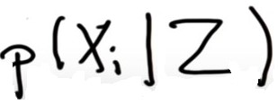

contents:
1. Introduction of Localization
2. Localization
3. Multiple Measurements
4. Exact Motion
5. Inexact Motion
6. Sense and Move
7. Localization Summary


## 1. Introduction of Localization
 Localization answers a question, where is a car or robot in a given map with a high accuracy.

Now assume:

* There is a car that is totally lost, which means you, as a driver or as a car, have no clue where you are. 
* You have a global map of the environment.


<p align="right">  </p> 

In a traditional way, we use global navigation satellite systems to find the car, with respect to the map. But GPS is not precise enough most of the time and has an accuracy about one to three meters and sometimes it can be as broad as 10 to 50 meters. Clearly this is not reliable enough for a self-driving car. You can't trust GPS and you have to find another technique to localize yourself inside a given map. 

It is common practice to use the onboard sensor data (like RADAR and LIDAR), along with our global map, to solve the localization issue. With the onboard sensors it is possible to measure distances to static obstacles, like trees, poles, or walls.We measure these distances, and the bearing of these static objects in the local coordinate system of our car. 

<p align="right">  </p> 

Now when you are lucky, the same obstacles that were observed by the on-board sensors are also part of the map. Of course, the map has its own global coordinate system. 

<p align="right">  </p> 

To estimate where the car is in the map, you have to match the observations with the map information and when you do it correctly, this results in a transformation between both coordinate systems (the local car coordinate system and the global coordinate system of the map). This transformation should be as accurate as possible-- let's say within a range of 10 centimetres 


Summarize of Introduction:

* Localization answers a question, where is a car in a given map with a high accuracy and high accuracy means between three and 10 centimetres. 

* A robot gathers information about its current environment and compares that to a known map to understand where it is in the world.


* On-board sensors are used to estimate the transformation between local measurements and a given map. 

## 2. Localization

The question is, how can a car know where it is with an accuracy of 10 cm? That is the localization question, which plays a key role. Localization has a lot of math, but before diving into mathematical details, I want to give you an intuition of the basic principles. 

#### Uniform Distribution: prior
You can think of a world with 5 different cells or places where each cell has the same probability that the robot might be in that cell. So probabilities add up to 1. 


<p align="right">  </p> 

As known the probability that the robot might be in a cell is 0.2 for each cell and the total probability is 1. We can code it like below in python:

```python
p=[]
n=5

for i in range(n):
    p.append(1./n)

print p
```

The uniform distribution is the most uncertain that the robot can possibly be. If it moves, that won't help our robot learn anything about it's position .

#### Probability after Sense:
Let's look at the measurement of this robot in its world with 5 different grid cells (x1-x5). Assume 2 of those cells are colored red whereas the other three are green. As before, we assign uniform probability to each cell of 0.2 and our robot is now allowed to sense. What it sees is a red color. 

<p align="right">  </p> 

**How will this affect my belief over different places?**

Obviously, the one's for x2 and x3 should go up and the ones for x1, x4, and x5 should go down. This measurement(seeing red color) incorporates into our belief with a very simple rule(a product). Any cell where the color is correct (red cell) we multiply it with a relatively large number (say, 0.6) whereas all the green cells will be multiplied with 0.2.

If we look at the ratio of those, then it seems about 3 times as likely to be in a red cell than it is to be in a green cell, because 0.6 is 3 times larger than 0.2. After multiplying, result would be like below:


<p align="right">  </p> 


You may notice that the probabilities do not add up to one(the probability distribution always has to add up to one), which should be fixed by learning about renormalization.


#### Normalize Distribution: posterior

After multiplying, the sum of the resulting probabilities is 0.36, which is less than one. It looks like we will need to figure out a way to make sure these probabilities actually add up to one. We turn this back into a probability distribution, by dividing each probability of the grid cells by 0.36. 


<p align="right">  </p> 

This is a probability distribution, which is often written in the following way ( The probability of each cell, i where i could range from 1-5, after we've seen our measurement Z).

<p align="right">  </p> 

The probabilist would also call it posterior distribution of place xi given measurement Z. The entire algorithm explained above can be implemented with the below python codes :

* A variable called "world," for each of the 5 grid cells specifies the color of the cell

* Z to define the measurement to be red

* "sense" define a function, which is the measurement update and which takes as input the initial distribution p and the measurement Z and all the other global variables.

* "sense" outputs a normalized distribution called "Q" in which Q reflects the normalized product of our input probability and the corresponding pHit or pMiss in accordance to the colors.

```python
p=[0.2, 0.2, 0.2, 0.2, 0.2]
world=['green', 'red', 'red', 'green', 'green']
Z = 'red'
pHit = 0.6
pMiss = 0.2
def sense(p, Z):
    q=[]
    for i in range(len(p)):
        hit = (Z == world[i])
        q.append(p[i] * (hit * pHit + (1-hit) * pMiss))
    return q/np.sum(q)
        
print sense(p,Z)
```
The outcome as expected: [0.11111111 0.33333333 0.33333333 0.11111111 0.11111111]

## 3. Multiple Measurements

To process any sequence of measurements of any length, Instead of z I am going to make a measurement vector called ‘measurement’, which can have multiple measurements then I modified the code so that it updates the probability based on the number of measurements.


```python
p=[0.2, 0.2, 0.2, 0.2, 0.2]
world=['green', 'red', 'red', 'green', 'green']
measurements = ['red', 'green']
pHit = 0.6
pMiss = 0.2

def sense(p, Z):
    q=[]
    for i in range(len(p)):
        hit = (Z == world[i])
        q.append(p[i] * (hit * pHit + (1-hit) * pMiss))
    s = sum(q)
    for i in range(len(q)):
        q[i] = q[i] / s
    return q


for i in range(len(measurements)):
    p=sense(p,measurements[i])
print p

```


## 4. Exact Motion

In this section, we will still be using the earlier concepts later on and shifting our focus onto what happens to our knowledge of location when our robot starts moving around.

1. Suppose we have a distribution such as below and even though we do not know where the robot is.
2. Assume the world is cyclic, if the robot drops off the right-most cell it finds itself in the left-most cell. 
3. The robot moves to the right and we know the world moved exactly 1 grid cell to the right, including the cyclic motion. After that motion, all these 5 values (the posterior probability) like as step 3 in the following figure.


<p align="right">  </p> 

To program this, I defined a function "move" with an input distribution p and a motion number "U" where U is the number of grid cells that the robot is moving to the right or to the left and returns the new distribution Q after the move. if U equals zero, Q is the same as p. If U equals 1, all the values are cyclically shifted to the right by 1 and if U equals 3, they are cyclically shifted to the right by 3. If U equals -1, they are cyclically shifted to the left.


```python
p=[0, 1, 0, 0, 0]
def move(p, U):
    q=[]
    for i in range(len(p)):
        q.append(p[i-U%len(p)])
    return q

print move(p, -1)

```
the expected value: [1, 0, 0, 0, 0]

## 5. Inexact Motion

In this section we are going to talk about inaccurate robot motion. It is really important to model inexact Motion,because this is the primary reason why localization is hard, because robots are not very accurate and attempts to go U grid cells, but occasionally falls short of its goal or overshoots. For example we are again given 5 grid cells and a robot executes its action(Say U = 2) with high probability correctly, say 0.8, but with 0.1 chance it finds itself short of the intended action and  another 0.1 probability it finds itself overshooting its target.

<p align="right">  </p> 


First, we are now going to look at the mathematical side by an example:

A prior distribution like below is given and we are going to be using the value of U = 2. For the motion model that shifts the robot exactly 2 steps:

* We believe there is a 0.8 chance that the robot will be in the correct cell
* We assign a 0.1 chance to the cases where the robot over or under shoots for the motion model that shifts the robot exactly 2 steps


<p align="right">  </p> 

As seen, this motion has added some uncertainty to the robot's position:


<p align="right">  </p> 

To modify the move procedure to accommodate these extra probabilities (pExact of 0.8, pOvershoot of 0.1, and pUndershoot of 0.1 )I am going to to add them into the move function.

```python
p=[0, 1, 0, 0, 0]
world=['green', 'red', 'red', 'green', 'green']
measurements = ['red', 'green']
pHit = 0.6
pMiss = 0.2
pExact = 0.8
pOvershoot = 0.1
pUndershoot = 0.1

def sense(p, Z):
    q=[]
    for i in range(len(p)):
        hit = (Z == world[i])
        q.append(p[i] * (hit * pHit + (1-hit) * pMiss))
    s = sum(q)
    for i in range(len(q)):
        q[i] = q[i] / s
    return q

def move(p, U):
    q = []
    for i in range(len(p)):
        s=pExact*(p[(i-U) % len(p)])
        s=s+pOvershoot*(p[(i-U-1) % len(p)])
        s=s+pUndershoot*(p[(i-U+1) % len(p)])
        q.append(s)
    return q
    

print (move(p, 2))
```

The expected values: [0.0, 0.0, 0.1, 0.8, 0.1]

In the code above we multiply the p value as before for the correct cell by pExact, then we add to it two more multiplied by pOvershoot or pUndershoot where we are overshooting by going yet 1 step further than U or undershooting by cutting it short by 1. Then we add these things up and finally append the sum of those to our output probability q. 

To move the robot as much time we want and print out the resulting distribution with the initial distribution p = [0, 1, 0, 0, 0]:
```python
for i in range(n):
    p=move(p, 1)
print(p)
```
**As the robot continues to move more and more gets uncertain about where it is, eventually it will reach the state of maximal uncertainty: the uniform distribution.**

## 6. Sense and Move

We talked about measurement updates, and  motion. We called these two routines "sense" and "move". Localization is nothing else but the iteration of "sense" and "move." .There is an initial belief that is tossed into this loop if you sense first.

<p align="right">  </p> 

Every time the robot moves, it loses information as to where it is. That is because robot motion is inaccurate. Every time it senses it gains information. That is manifest by the fact that after motion, the probability distribution is a little bit flatter and a bit more spread out and after sensing, it's focused a little bit more.

There is a measure of information called "entropy.", which will decrease after the measurement update (sense) step and after the movement step (move) entropy will increase . In general, entropy represents the amount of uncertainty in a system. Since the measurement update step decreases uncertainty, entropy will decrease. The movement step increases uncertainty, so entropy will increase after this step.

Look at our current example where the robot could be at one of five different positions. The maximum uncertainty occurs when all positions have equal probabilities: [0.2, 0.2, 0.2, 0.2, ,0.2]

Following the formula Entropy=Σ(−p×log(p))  we get −5×(.2)×log(0.2)=0.699 

Taking a measurement will decrease uncertainty and entropy. Let's say after taking a measurement, the probabilities become [0.05,0.05,0.05,0.8,0.05]. Now we have a more certain guess as to where the robot is located and our entropy has decreased to 0.338.

In addition two measurement we had before, I am going to give to motion=[1,1] which means the robot moves right and then right again, compute the posterior distribution if the robot first senses red, then moves right one, then senses green, then moves right again.

```python
p=[0.2, 0.2, 0.2, 0.2, 0.2]
world=['green', 'red', 'red', 'green', 'green']
measurements = ['red', 'green']
motions = [1,1]
pHit = 0.6
pMiss = 0.2
pExact = 0.8
pOvershoot = 0.1
pUndershoot = 0.1

def sense(p, Z):
    q=[]
    for i in range(len(p)):
        hit = (Z == world[i])
        q.append(p[i] * (hit * pHit + (1-hit) * pMiss))
    s = sum(q)
    for i in range(len(q)):
        q[i] = q[i] / s
    return q

def move(p, U):
    q = []
    for i in range(len(p)):
        s = pExact * p[(i-U) % len(p)]
        s = s + pOvershoot * p[(i-U-1) % len(p)]
        s = s + pUndershoot * p[(i-U+1) % len(p)]
        q.append(s)
    return q
for i in range (len(measurements)):
    p=sense(p,measurements[i])
    p=move(p,motions[i])
print (p)

```

As seen int the result values : [0.21, 0.15, 0.08, 0.16, 0.38]  the robot saw green correctly, moved right again It now finds itself most likely in the right-most cell (the fifth cell). This is just looking at result values.


## 6. Localization Summary

We learned that localization maintains a function over all possible places where a road might be, where each cell has an associated probability value.

The measurement update function, or "sense," is nothing else but a product in which we take those probability values and multiply them up or down depending on the exact measurement.Because the product might violate the fact that probabilities add up to 1, there was a product followed by normalization. 

Motion was a convolution. for each possible location after the motion, we reverse engineered the situation and guessed where the world might have come from and then added the corresponding probabilities. 

**Something as simple as multiplication and addition solves all of localization.**

<p align="right">  </p> 

I want to go over the formal definition of localization:

**1. The measurement update function or sense:**

will lead to something called **Bayes Rule**. It's the most fundamental consideration in probabilistic inference. Suppose x is my grid cell and Z is my measurement. The measurement update seeks to calculate a belief over my location after seeing the measurement.  How is this computed? It turns out Bayes Rule which looks like below

<p align="right">  </p> 

The product of the prior of the grid cell times the measurement probability, which was large if the measurement corresponded to the correct color and small if it corresponded to a false color. That product gave us the non-normalized posterior distribution for the grid cell. The normalization is now the constant p(Z).  p(Z) is the sum over all the product of the prior of the grid cell times the measurement probability.
<p align="right">  </p> 

Put differently:
 
The p with a bar called the non-normalized probability:

<p align="right">  </p> 

To compute the normalizer, which called "α" all of the non-normalized probabilities should be added.

<p align="right">  </p> 

The resulting probability will be:

<p align="right">  </p> 


**2. The motion function or move:**

look at motion, which will turn out to be something we will call **total probability**. You remember that we cared about a grid cell "xi" and we asked what is the chance of being in xi after robot motion?  To indicate after and before, a time index is added (T up X, is an index for time).

The way we find the posterior probability for xi is to go through all possible places from which it could have come, all the different j's. Look at the prior probabilities, multiply it by the probability that I transition from j to i given my motion command, which in this case is go 1 to the right side. 


<p align="right">  </p> 

